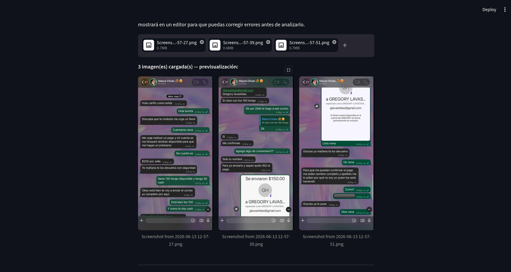
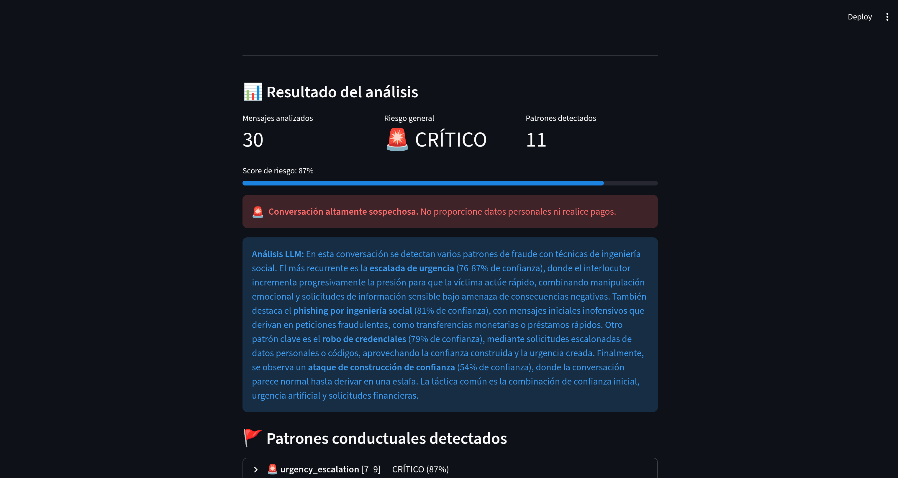
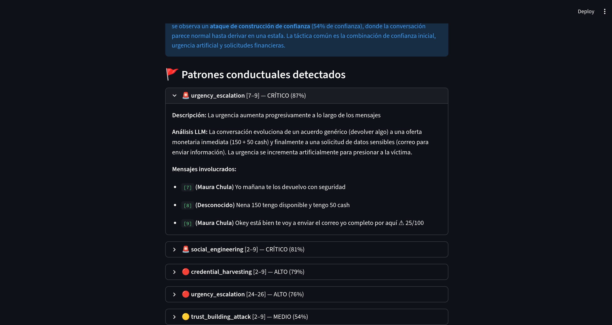

# Sistema de Detección de Mensajes Fraudulentos

Sistema de inteligencia artificial para detectar intentos de fraude en mensajes digitales — SMS, WhatsApp y correo electrónico. Analiza mensajes individuales, conversaciones completas y capturas de pantalla de chats para identificar smishing, phishing, suplantación de identidad y técnicas de ingeniería social.

Si bien el sistema está diseñado para ser de propósito general, gran parte de las pruebas y validaciones se realizaron empleando patrones de estafa reales extraídos del contexto de las **ventas digitales en Cuba**, donde en los últimos años han proliferado fraudes en plataformas de compraventa como Revolico y grupos de WhatsApp: vendedores falsos que cobran por adelantado sin entregar el producto, suplantación de compradores para estafar a vendedores, y conversaciones diseñadas para generar urgencia o confianza artificial antes de solicitar transferencias.

---

## ¿Para qué sirve?

El sistema permite a cualquier persona u organización:

- **Verificar mensajes sospechosos** antes de responder o realizar un pago
- **Analizar conversaciones completas** para detectar si alguien está siendo manipulado gradualmente
- **Subir capturas de WhatsApp o SMS** para que la IA lea el texto y evalúe el riesgo automáticamente
- **Ajustar los umbrales de detección** en tiempo real desde la interfaz, sin reentrenar nada

---

## Arquitectura del sistema

El sistema combina **9 capas de análisis** en cascada. Las capas más rápidas y baratas se ejecutan primero; solo los casos ambiguos llegan a las capas costosas (LLM):

```
Mensaje de entrada
        │
        ▼
 ┌─────────────────┐
 │ 1. Reglas       │  Siempre · ~0 ms · detecta URLs, urgencia, credenciales
 │    heurísticas  │  Puntaje 0–100 sobre 11 categorías de señales
 └────────┬────────┘
          │
          ▼
 ┌─────────────────┐
 │ 2. LightGBM     │  Siempre · ~5 ms · TF-IDF (1–3 gramas) + 17 features
 │    (ML)         │  Accuracy 98.21 % · F1-fraude 0.93
 └────────┬────────┘
          │
          ├── 3. Isolation Forest   (anomalías — fraudes nunca vistos)
          ├── 4. Red Bayesiana      (combinaciones de señales)
          ├── 5. CBR                (top-7 casos más similares)
          │
          ▼
    ┌─ Gate 1 ──────────────────────────────────────────────────┐
    │  Si ML muy seguro + reglas alineadas → resultado inmediato │
    └────────────────────────────────────────────────────────────┘
          │  (solo casos ambiguos continúan)
          ▼
 ┌─────────────────┐
 │ 6. Embeddings   │  Condicional · ~300 ms · índice semántico mistral-embed
 │    semánticos   │
 └────────┬────────┘
          │
    ┌─ Gate 2 ──────────────────────────────────────────────────┐
    │  Si embeddings confirman → resultado inmediato             │
    └────────────────────────────────────────────────────────────┘
          │  (< 35 % de mensajes llegan aquí)
          ▼
 ┌─────────────────┐
 │ 7. LLM Mistral  │  Solo ambiguos · ~1 s · open-mistral-nemo · análisis
 │                 │  semántico profundo con JSON estructurado
 └────────┬────────┘
          │
          ▼
 ┌─────────────────┐
 │ 8. Meta-learner │  Combina las 8 señales anteriores con LightGBM aprendido
 │    (stacking)   │  AUC-ROC 0.9991
 └────────┬────────┘
          │
          ▼
 ┌─────────────────┐
 │ 9. BiLSTM       │  Análisis conversacional multi-turno (patrones de
 │    conversación │  manipulación secuencial) · Accuracy 91.37 %
 └─────────────────┘
```

### Técnicas de optimización integradas

| Técnica | Para qué se usa |
|---------|----------------|
| **PSO** (Enjambre de Partículas) | Optimiza los 4 hiperparámetros de LightGBM en el espacio `[50,500]×[2,10]×[0.01,0.30]×[5,80]` |
| **Recocido Simulado** | Ajusta los 5 umbrales de la cascada; acepta soluciones peores con probabilidad decreciente |
| **Búsqueda Tabú** | Misma optimización de umbrales con memoria explícita de los últimos 15 vectores visitados |
| **Monte Carlo** | Genera 200 perturbaciones por mensaje y mide `stability = 1 − σ/μ` |
| **EDA** (Estimación de Distribuciones) | Aprende P(palabra\|fraude) y genera mensajes sintéticos individuales sin API externa |
| **ACO** (Colonia de Hormigas) | Detecta el arco narrativo de manipulación en conversaciones (en qué mensaje empieza la estafa) |
| **DES** (Eventos Discretos) | Genera conversaciones sintéticas completas con una máquina de 8 estados para entrenar el BiLSTM |

---

## Requisitos

- Python 3.10 o superior
- API key de Mistral AI — gratuita en [console.mistral.ai](https://console.mistral.ai)

```bash
pip install -r requirements.txt
```

---

## Configuración

Crea el archivo `.env` en la raíz del proyecto:

```bash
cp .env.example .env
```

Edita `.env` y añade tu clave:

```
MISTRAL_API_KEY=tu_clave_aqui
```

La clave activa los cuatro roles del LLM en el sistema:

| Rol | Modelo | Cuándo se activa |
|-----|--------|-----------------|
| Embeddings semánticos | `mistral-embed` | Siempre — construye el índice y calcula similitud |
| Clasificación individual | `open-mistral-nemo` | Solo si Puerta 1 y Puerta 2 no se activan (~35 % de mensajes) |
| OCR de capturas de pantalla | `pixtral-12b-2409` | Cuando la entrada es una imagen, antes de la cascada |
| Análisis conversacional | `open-mistral-nemo` | Cuando el score conversacional ≥ 0.55 tras el BiLSTM |

El clasificador individual devuelve JSON estructurado con `verdict`, `confidence`, `fraud_type`, `indicators` y `explanation`. El análisis conversacional recibe la secuencia completa de mensajes con índices y remitentes, identifica patrones conductuales por rango de mensajes y genera el párrafo narrativo que se muestra en la interfaz.

> El sistema **funciona sin la clave** usando solo ML + reglas + Bayes + CBR. Los casos sutiles y el análisis conversacional profundo se ven reducidos pero la cascada base sigue operativa.

---

## Entrenamiento de modelos

El entrenamiento se hace **una única vez**. Ejecutar en este orden:

```bash
# 1. Preparar y normalizar el dataset
python main.py prepare

# 2. Clasificador ML principal (LightGBM)
python main.py train --dataset data/processed/messages.csv --model lightgbm

# 3. Detector de anomalías — fraudes de tipos nuevos (Isolation Forest)
python main.py train-anomaly --dataset data/processed/messages.csv

# 4. Red Bayesiana — combinaciones de señales
python main.py train-bayes --dataset data/processed/messages.csv

# 5. Base de casos CBR — memoria de fraudes conocidos
python main.py build-cases --dataset data/processed/messages.csv

# 6. Índice semántico — requiere MISTRAL_API_KEY
python main.py build-index --dataset data/processed/messages.csv --sample 500

# 7. Meta-learner — combina todas las señales anteriores
python main.py train-meta --dataset data/processed/messages.csv --sample 2000

# 8. Datos sintéticos con el simulador DES
python main.py simulate-conversations --n 500 --output data/processed/des_conversations.csv

# 9. Modelo conversacional BiLSTM
python main.py train-conversation-model \
  --dataset data/processed/messages.csv \
  --des-dataset data/processed/des_conversations.csv
```

---

## Iniciar la interfaz web

```bash
streamlit run app/streamlit_app.py
```

Abre [http://localhost:8501](http://localhost:8501) en tu navegador.

---

## Casos de uso

### Modo 1 — Analizar un mensaje individual

Pega cualquier SMS, WhatsApp o correo sospechoso. El sistema devuelve:
- Clasificación (fraude / legítimo) con nivel de riesgo (bajo / medio / alto)
- Señales detectadas que justifican el veredicto
- Confianza del modelo y puntaje de riesgo sobre 100
- Explicación SHAP de las características más influyentes

**Ejemplo de mensaje a analizar:**
```
ALERTA BBVA: Su cuenta fue bloqueada por actividad sospechosa.
Verifique sus datos en http://bbva-seguro-mx.com antes de 24 hrs
o perderá el acceso permanentemente.
```

**Cómo usarlo desde CLI:**
```bash
python main.py predict --message "ALERTA BBVA: Su cuenta fue bloqueada..."
```

---

### Modo 2 — Analizar una conversación

Pega los mensajes línea a línea o en formato JSON. El sistema detecta patrones de comportamiento fraudulento a lo largo de la conversación.

**Patrones que detecta:**

| Patrón | Descripción |
|--------|-------------|
| `urgency_escalation` | La urgencia aumenta progresivamente |
| `credential_harvesting` | Solicitud gradual de NIP, OTP, contraseñas |
| `social_engineering` | Mensajes iniciales inocentes que derivan en fraude |
| `impersonation` | Suplantación de banco, SAT, empresa conocida |
| `prize_scam_sequence` | Premio falso seguido de solicitud de datos o pago |
| `financial_coercion` | Presión o amenaza + solicitud de transferencia |
| `trust_building_attack` | Construcción de confianza + pivote al fraude |

**Ejemplo de conversación fraudulenta (suplantación de identidad para pago de servicio):**
```
Un mensaje por línea (modo texto plano):
Hola, ¿cómo estás? Soy Maura, te contacto de parte de Gregory Lavas
Te paso su perfil y correo para que veas que es de confianza
El servicio cuesta 150, tengo 50 en cash también
¿Me puedes pasar tu correo para enviarte la confirmación?
```

> Este patrón — presentar la identidad de un tercero como respaldo, enmarcar el pago como "servicio" y solicitar datos personales al final — es una de las variantes de fraude más frecuentes y difíciles de detectar por mensaje individual, porque ningún mensaje por separado contiene vocabulario obviamente sospechoso.

**Cómo usarlo desde CLI:**
```bash
python main.py analyze-conversation \
  --messages '[{"text":"Hola soy Maura"},{"text":"Necesito un préstamo urgente"}]'
```

---

### Modo 3 — Analizar capturas de pantalla de chat

Sube una o varias imágenes de la conversación (PNG, JPG, WEBP). La IA lee el texto de cada captura con OCR, te lo muestra en un editor para que corrijas errores, y luego analiza toda la conversación.

**Flujo completo con caso de uso real:**

**Caso real analizado: suplantación de identidad para pago de servicio**

La conversación analizada muestra una estafa en la que el atacante suplanta la identidad de un tercero —presentando su perfil completo, nombre y correo como garantía de legitimidad— para solicitar el pago de un supuesto servicio y en el proceso obtener datos personales de la víctima. Ningún mensaje individual contiene vocabulario sospechoso obvio; la señal de fraude emerge del patrón de la secuencia completa.

**Paso 1 — Subir las capturas**

El usuario sube 3 capturas de pantalla de WhatsApp. El modelo `pixtral-12b-2409` extrae el texto de cada imagen mediante OCR y lo incorpora como mensajes numerados al pipeline de análisis:



---

**Paso 2 — Resultado del análisis: riesgo CRÍTICO**

Con 30 mensajes analizados, el sistema detectó 11 patrones de comportamiento fraudulento y asignó riesgo **CRÍTICO** con un score de 87 %:



El análisis LLM (`open-mistral-nemo`) recibió la secuencia completa de 30 mensajes e identificó cuatro técnicas de manipulación activas en simultáneo:
- **Escalada de urgencia** (76–87 % confianza): la presión para actuar aumenta artificialmente en cada turno
- **Phishing por ingeniería social** (81 %): mensajes iniciales inofensivos que derivan en solicitud de datos financieros
- **Robo de credenciales** (79 %): solicitudes escalonadas de correo electrónico y datos personales
- **Ataque de construcción de confianza** (54 %): conversación aparentemente normal que deriva en estafa

---

**Paso 3 — Detalle de los patrones detectados por rango de mensajes**

Cada patrón muestra el rango exacto de mensajes donde se manifiesta, el nivel de confianza individual y el análisis LLM de la táctica concreta empleada:



> La mecánica del fraude se desarrolla en tres actos: (1) presentar la identidad suplantada con perfil y correo como prueba de legitimidad, (2) negociar el monto encuadrándolo como pago de un servicio (no como petición de dinero directa), (3) solicitar el correo de la víctima con el pretexto de "enviar la confirmación" — cuyo objetivo real es obtener datos de contacto para explotarlos posteriormente.

---

## Configuración avanzada desde la interfaz

La barra lateral de Streamlit expone todos los umbrales del sistema como controles deslizantes. Cambiarlos **no requiere reentrenamiento**:

**Cascada de detección** — 10 parámetros:
- Certeza ML para cortocircuitar la cascada (defecto: 0.95)
- Puntuación mínima de reglas para confirmar fraude (defecto: 65/100)
- Umbrales de embeddings, anomalía, Bayes, CBR y meta-learner

**Análisis conversacional** — 8 parámetros:
- Umbral candidato (defecto: 0.40) — qué tan sospechosa debe ser una ventana
- Umbral LLM (defecto: 0.55) — cuándo invocar el modelo de lenguaje
- Pesos del modelo ML vs. patrón estadístico
- Niveles de riesgo (crítico / alto / medio)

---

## Tests

```bash
python -m pytest tests/ -v
# Resultado esperado: 243 passed
```

---

## Comandos CLI adicionales

```bash
# Optimizar hiperparámetros con PSO (guarda en models/pso_hyperparams.json)
python main.py optimize-hyperparams \
  --dataset data/processed/messages.csv --n-particles 20 --max-iter 50

# Reentrenar LightGBM con los hiperparámetros PSO optimizados
python main.py train --dataset data/processed/messages.csv \
  --model lightgbm --use-pso-params

# Optimizar umbrales de la cascada (SA vs Tabú — elige el mejor)
python main.py optimize-thresholds \
  --dataset data/processed/messages.csv --method both --max-iter 200

# Análisis de robustez Monte Carlo (estabilidad ante perturbaciones)
python main.py analyze-robustness \
  --message "Urgente: verifique su cuenta BBVA" --n-simulations 200

# Generar mensajes sintéticos de fraude sin API (EDA)
python main.py generate-synthetic \
  --dataset data/processed/messages.csv --n 500 \
  --output data/processed/synthetic_fraud.csv

# Analizar conversación con ACO (detecta el arco de manipulación)
python main.py analyze-conversation --aco \
  --messages '[{"text":"Hola"},{"text":"Su cuenta fue bloqueada urgente"},{"text":"Verifique su NIP en este enlace"}]'
```

---

## Estructura del proyecto

```
fraud-message-detection/
│
├── data/
│   ├── raw/                          # Datasets originales (SMS Spam Collection, etc.)
│   └── processed/
│       ├── messages.csv              # Dataset principal (5,572 mensajes)
│       ├── des_conversations.csv     # Conversaciones sintéticas DES
│       └── adversarial.csv           # Ejemplos adversariales para robustez
│
├── models/                           # Artefactos entrenados
│   ├── lightgbm_model.joblib         # Clasificador ML principal
│   ├── tfidf_vectorizer.joblib       # Vectorizador TF-IDF compartido
│   ├── anomaly_detector.joblib       # Isolation Forest
│   ├── bayes_net.joblib              # Red Bayesiana
│   ├── case_base.npz                 # Base de casos CBR
│   ├── semantic_index.npz            # Índice de embeddings semánticos
│   ├── meta_learner.joblib           # Meta-learner stacking
│   ├── conversation_model.joblib     # BiLSTM conversacional
│   └── pso_hyperparams.json          # Hiperparámetros PSO (si se optimizaron)
│
├── src/
│   ├── config.py                     # Configuración centralizada (rutas, constantes)
│   ├── data/                         # Carga y preprocesamiento de datos
│   ├── rules/                        # Motor de reglas heurísticas
│   ├── ml/
│   │   ├── features.py               # TF-IDF + 17 características manuales + NER
│   │   ├── train.py                  # Pipeline de entrenamiento
│   │   ├── predict.py                # Predicción con FraudPredictor
│   │   ├── anomaly.py                # Isolation Forest
│   │   ├── bayesian_net.py           # Red Bayesiana (6 variables)
│   │   ├── explain.py                # Explicaciones SHAP
│   │   ├── monte_carlo.py            # Análisis de robustez
│   │   ├── pso_optimizer.py          # PSO para hiperparámetros
│   │   ├── tabu_optimizer.py         # Búsqueda Tabú para umbrales
│   │   ├── threshold_optimizer.py    # Recocido Simulado para umbrales
│   │   └── eda_fraud_generator.py    # Generación sintética sin API
│   ├── detection/
│   │   ├── cascade.py                # Orquestación de las 9 capas
│   │   ├── case_base.py              # Razonamiento Basado en Casos
│   │   └── meta_learner.py           # Meta-learner LightGBM (stacking)
│   ├── llm/
│   │   ├── analyzer.py               # Análisis semántico con Mistral
│   │   └── embeddings.py             # Índice semántico mistral-embed
│   └── conversation/
│       ├── analyzer.py               # Orquestador del análisis conversacional
│       ├── features.py               # Extractor de features por ventana
│       ├── patterns.py               # Definición de los 7 patrones
│       ├── sequence_model.py         # BiLSTM + Atención
│       ├── aco_path.py               # ACO — arco narrativo de manipulación
│       └── des_simulator.py          # Simulador de Eventos Discretos
│
├── app/
│   └── streamlit_app.py              # Interfaz web (3 modos + sidebar configuración)
│
├── assets/                           # Capturas de pantalla para documentación
│
├── tests/                            # 243 tests unitarios e integración
│
├── docs/
│   ├── informe_proyecto.md           # Informe técnico completo
│   └── informe_proyecto.tex          # Paper en formato LNCS (LaTeX)
│
├── .env.example                      # Plantilla de configuración
├── requirements.txt                  # Dependencias Python
└── main.py                           # CLI principal
```

---

## Resultados

| Configuración | Accuracy | F1 (fraude) | AUC-ROC |
|---------------|----------|-------------|---------|
| Solo reglas heurísticas | ~86% | — | — |
| LightGBM | 98.21% | 0.93 | 0.976 |
| + Anomaly + Bayes + CBR | 98.61% | 0.93 | 0.985 |
| + Embeddings + LLM | 98.74% | 0.94 | 0.997 |
| + Meta-learner (cascada completa) | **98.86%** | **0.94** | **0.9991** |
| BiLSTM conversacional | 91.37% | — | — |

---

## Dataset

- **Fuente**: SMS Spam Collection (UCI / Kaggle) + mensajes en español anotados manualmente
- **Tamaño real**: 5,572 mensajes — 747 fraude (13.4%) / 4,825 legítimos (86.6%)
- **Datos sintéticos DES**: 2,118 mensajes adicionales generados con el simulador de eventos discretos, cubriendo 7 patrones de estafa habituales: phishing bancario, suplantación de entidades, paquetería falsa, sorteos fraudulentos, solicitud de OTP, empleo falso y compraventa digital fraudulenta

Las pruebas de validación se orientaron especialmente a patrones documentados en el contexto cubano: cobro por adelantado sin entrega de producto, suplantación de identidad (presentar el perfil de un tercero para dar credibilidad a una solicitud de pago de servicio), y conversaciones de ingeniería social que escalaban gradualmente hacia la solicitud de transferencias o datos personales. Este último tipo —donde la señal de fraude está en la secuencia, no en palabras clave— es el que motivó la inclusión del análisis conversacional con BiLSTM y del módulo OCR para analizar capturas de pantalla de WhatsApp.

---

## Limpieza y preparación de los datos

El comando `python main.py prepare` ejecuta el pipeline completo de ingesta y normalización antes de cualquier entrenamiento.

### 1. Carga flexible de archivos

`src/data/loader.py` acepta CSV y TSV con cualquier estructura de columnas. El sistema detecta automáticamente qué columna contiene el texto y cuál la etiqueta usando listas de alias conocidos:

| Tipo | Alias aceptados |
|------|-----------------|
| Texto | `text`, `sms`, `message`, `body`, `email`, `content`, `msg` |
| Etiqueta | `label`, `category`, `target`, `class`, `type`, `v1`, `Tag` |

La codificación del archivo se detecta automáticamente (UTF-8 o Latin-1), lo que permite procesar datasets en inglés y español sin configuración adicional.

### 2. Normalización de etiquetas

Las etiquetas crudas del dataset se mapean a tres clases uniformes:

| Etiqueta normalizada | Valores de origen aceptados |
|---------------------|---------------------------|
| `legitimate` | `ham`, `safe`, `normal`, `ok`, `benign`, `not_spam` |
| `fraudulent` | `spam`, `smishing`, `phishing`, `fraud`, `scam`, `malicious` |
| `suspicious` | `warning`, `unknown` |

Las filas con etiquetas no reconocidas se descartan y se registran como advertencias. Cada fila conserva además una columna `source` que indica de qué archivo de origen proviene.

### 3. Limpieza del texto

`src/data/preprocessing.py` aplica las siguientes transformaciones antes de extraer características:

1. **Reemplazo de entidades por tokens** — preserva la señal semántica sin sobreajustar a URLs o números concretos:
   - URLs → `<URL>` (cubre http/https, www, dominios .mx/.com/.io y acortadores como bit.ly)
   - Correos → `<EMAIL>`
   - Teléfonos (≥ 7 dígitos) → `<PHONE>`
   - Cantidades de dinero (pesos, dólares, euros, etc.) → `<MONEY>`

2. **Normalización de texto**:
   - Conversión a minúsculas
   - Eliminación de caracteres irrelevantes (se preservan letras con tilde, ñ, signos de puntuación y símbolos de frecuencia en mensajes de fraude)
   - Colapso de espacios múltiples

### 4. Extracción de características

Sobre el texto ya limpio se construye un vector de **10,017 dimensiones**:

- **TF-IDF** (10,000 features): n-gramas de 1 a 3 palabras, `min_df=2`, `sublinear_tf=True` para reducir el peso de términos muy frecuentes
- **17 características manuales**: longitud del mensaje, conteo de palabras, mayúsculas, signos de exclamación e interrogación, presencia de URL/teléfono/email/dinero, palabras de urgencia, credenciales, premios y puntuación de negación contextual (ventana de 5 tokens alrededor de señales de fraude)

---

## Licencia

Uso académico. Proyecto Final — Inteligencia Artificial 2025-2026.
